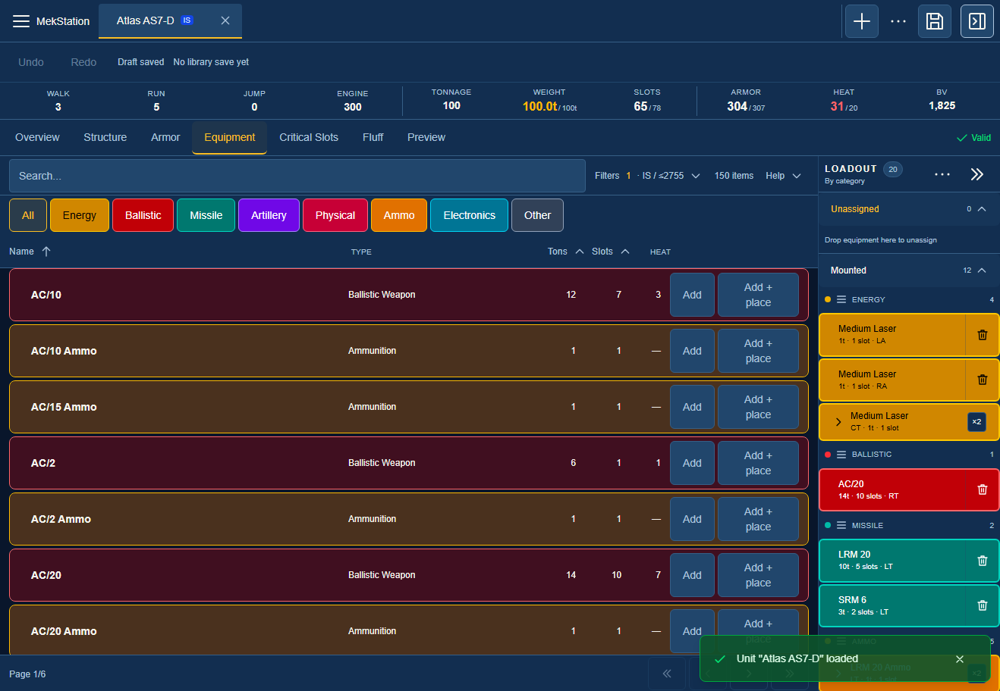
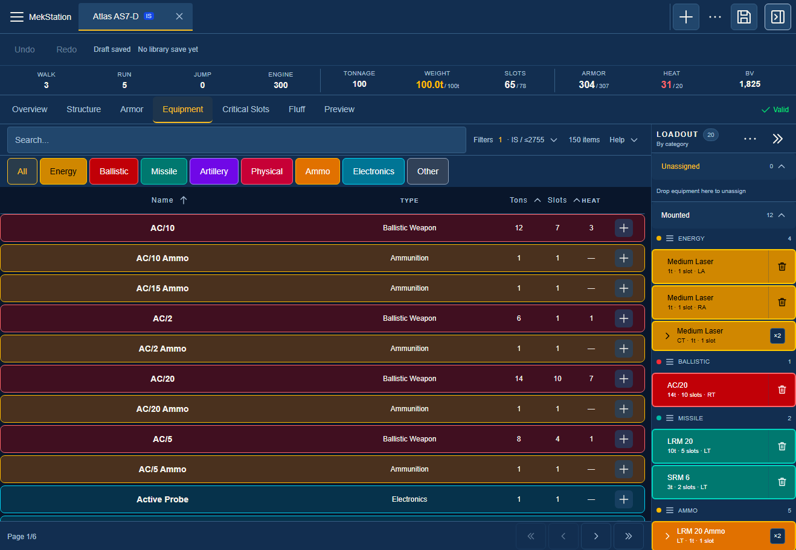
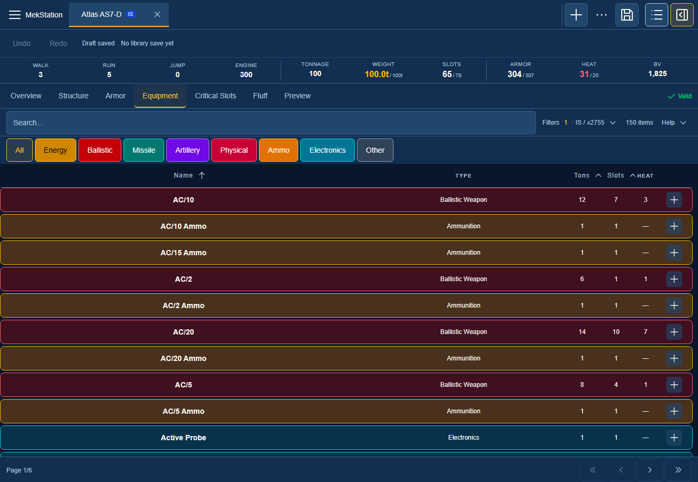
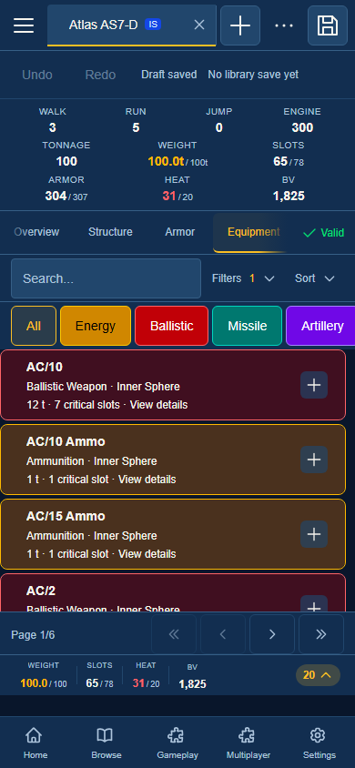
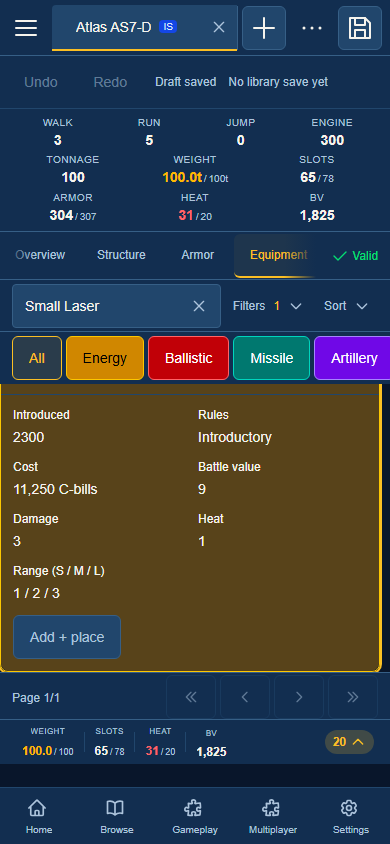

# Equipment catalog density verification

Verified on 2026-09-10 against production build 1789079061725.

The catalog shows a compact plus button on each row. Add + place appears when the item details are expanded. Header and row values share the same centered grid, including while scrolling and when the loadout sidebar is open or closed.

| Measurement at 1318 by 912              |                    Before |       After |
| --------------------------------------- | ------------------------: | ----------: |
| Collapsed row height, 12 sampled items  |                     70 px |       46 px |
| Largest header/row column-center offset |                     13 px |        0 px |
| Sort label offset from value center     | Previously visibly offset |        0 px |
| Visible plus control                    |           Text Add button | 30 by 30 px |
| Plus click target                       |            At least 44 px | 44 by 44 px |

The measured row height is 34% smaller. The current standard desktop catalog fits ten complete rows in the measured viewport. Long names truncate with the full name available through the title and accessible button name. At 390 by 844, details and the placement action remain reachable without document overflow.

Verification passed: 27 tests across the equipment browser, card, placement dialog, and equipment tab; full TypeScript check; lint with zero errors and 84 warnings; formatter check for six source/test files; strict validation of repair-equipment-catalog; production build; and four Playwright scenarios. Browser scenarios cover category/ammo filters, plus addition, keyboard detail expansion and placement focus, 25 compact rows, actual sort-label centering, sticky-header scrolling, both sidebar states, mobile layout, placement cancellation, placement persistence, one-step undo, and independent copies.

The first browser-selector migration used a Playwright-only exact option in a Testing Library call. The parent type check found it; the Grok worker removed that option and the full type check and focused tests passed. The first specification invocation used an unavailable local installation path; validation passed using the installed command. Initial attempt logs remain in the local work directory.

Implementation and test changes were made through Grok CLI workers using grok-4.6 with high reasoning; the parent reviewed source, ran final gates, measured the page, and inspected screenshots. The capability check retained the previously identified unrelated interview-protocol skill hash drift; no global configuration was changed.

The 76 pre-existing files outside this follow-up's ownership matched their starting hashes. No commits, staging, task checkbox changes, database migrations, or external publications were performed. The full repository test suite was not rerun for this presentation-only follow-up; the earlier equipment-catalog audit records its separate results and unrelated failure.

The preview on port 3611 uses the existing runtime data directory and this build. The separate browser verification server on port 3635 uses isolated databases. Browser contexts are disposable and do not alter the user's existing tabs or browser profile.

Files: checks.json contains command outcomes, production source hashes, and geometry; before-metrics.json and after-metrics.json contain raw measurements; browser-results.json contains scenario results. The screenshots below were reviewed by the parent.

Final runtime check: port 3611 returned HTTP 200 with the verified build ID; the owned port 3635 test process was stopped and its port released.
