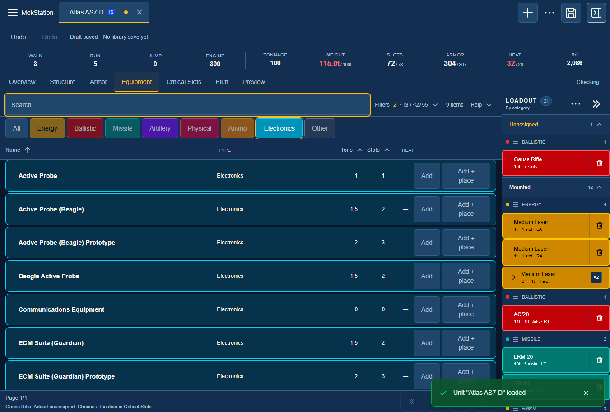
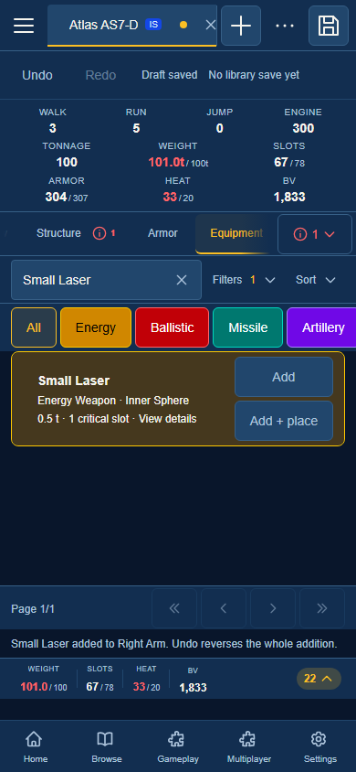
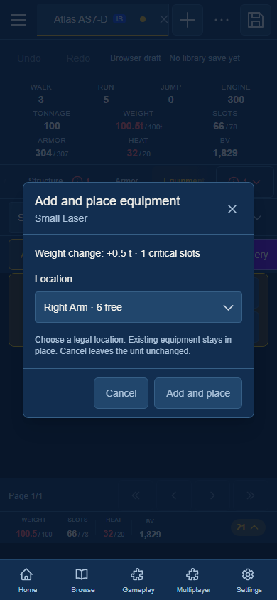

# Equipment catalog repair — 2026-09-10

The equipment catalog now has an independent Electronics filter, exact ammunition compatibility, current results after unit edits, translucent rows, and optional Add and place. The existing Add action still adds an unassigned copy.

## Behavior and cause

- Electronics previously sat inside Other. Alphabetical ammunition rows also pushed Electronics beyond the first page, making the ammo toggle appear necessary to find it. Electronics now has its own primary category; Other contains utility, movement, and structural equipment.
- Ammunition now retains declared compatible weapon IDs. Exact compatibility keeps SRM, LRM, Gauss, and declared Clan matches without AC/2 admitting AC/20. Imported rows without declarations use a conservative full normalized identity fallback.
- The browser subscribes to the active unit context and uses the same filtered array for rows, counts, and pagination. Weapon additions, removals, undo/redo, unit switches, availability, and numeric filters refresh the list.
- Row fills use 30% opacity, increasing to 40% for hover/expanded state. Content remains opaque.
- Add and place previews calculated weight and critical slots, offers legal locations with free-slot counts, and rechecks the current loadout when confirmed. It shares placement rules with Critical Slots and creates one undoable edit. Cancel, unavailable locations, read-only UI, and unsupported split allocation leave the draft unchanged.

## Verification

| Check                                     | Result                                                                            |
| ----------------------------------------- | --------------------------------------------------------------------------------- |
| New regression characterization           | 14 failures before repair; all pass afterward                                     |
| Focused catalog and placement checks      | 9 suites / 182 tests pass                                                         |
| Independent final browser run             | All 5 scenarios pass, no retries or skips                                         |
| Full stable suite                         | 2,662 suites and 35,134 tests pass; one unrelated failure below; 16 skipped tests |
| TypeScript                                | Pass                                                                              |
| Lint                                      | 0 errors; 84 existing warnings                                                    |
| Formatting                                | Owned files pass; 13 unrelated audit files remain unformatted                     |
| Strict OpenSpec                           | 230 items pass                                                                    |
| Production build and standalone hydration | Pass; build `1789075502145`                                                       |
| Other active work                         | 41 file hashes unchanged; prior ledger contents preserved exactly                 |

Browser evidence covers independent Electronics, SRM/LRM/Gauss compatibility, weapon add/undo/redo, cancellation, illegal Head placement, valid slots, one-step undo/redo, browser-draft reload, and desktop/mobile layouts. Existing catalog mounting/moving and saved-library revision recovery scenarios also pass. Viewports were 1351×912 and 390×844; this is Chromium responsive emulation, not physical mobile-device testing. Added test equipment intentionally exceeds tonnage in some screenshots; this does not assert construction legality of those test designs.

The full stable suite's sole remaining failure is `scripts/__tests__/qc-registry.test.ts`: the pre-existing `/compendium/chassis` route is absent from the app-shell coverage manifest. It belongs to the other active chassis work. The unrelated formatting failures are in its audit files and the model-library audit; those files were preserved.

An initial browser assertion incorrectly treated a disabled option inside a label as the enabled enclosing select. Grok replaced that matcher with the native option's `disabled` property and retained disabled-confirm gating. Parent review confirmed the behavior in the installed Playwright source, then reran all five scenarios. Earlier failed attempts remain in the local evidence directory.

## Grok CLI work

Three Grok CLI `grok-4.6` workers ran in parallel with explicit `high` effort and separate ownership. The filter and placement reviews found no remaining actionable defects. The browser worker implemented the assertion correction. Parent review confirmed the reports, checked source hashes, and performed the final combined browser run. Initial turn-limited sessions were resumed rather than duplicated.

- [Filter review](filter-worker-report.md)
- [Placement review](placement-worker-report.md)
- [Browser repair](browser-worker-report.md)
- [Machine-readable checks](checks.json)

## Preview and evidence

The preview at [localhost:3611](http://localhost:3611/customizer) serves the verified build using its existing preview databases. Browser tests used isolated browser contexts and separate databases on port 3634. The isolated test server was shut down after verification. No staging, commit, push, or unrelated-file repair was performed. OpenSpec task checkboxes were left unchanged.

Detailed logs and preserved failed attempts: `.sisyphus/equipment-catalog-20260910/`.

