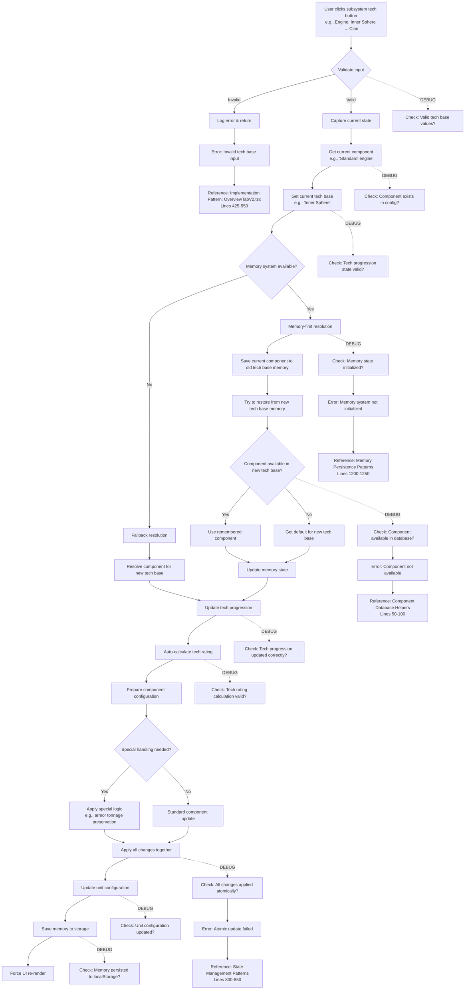
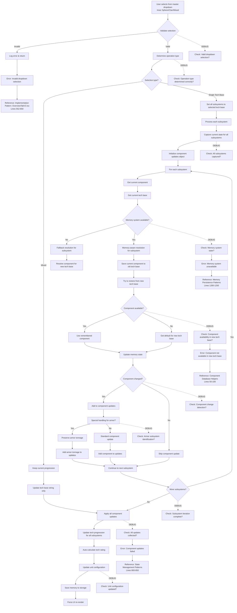
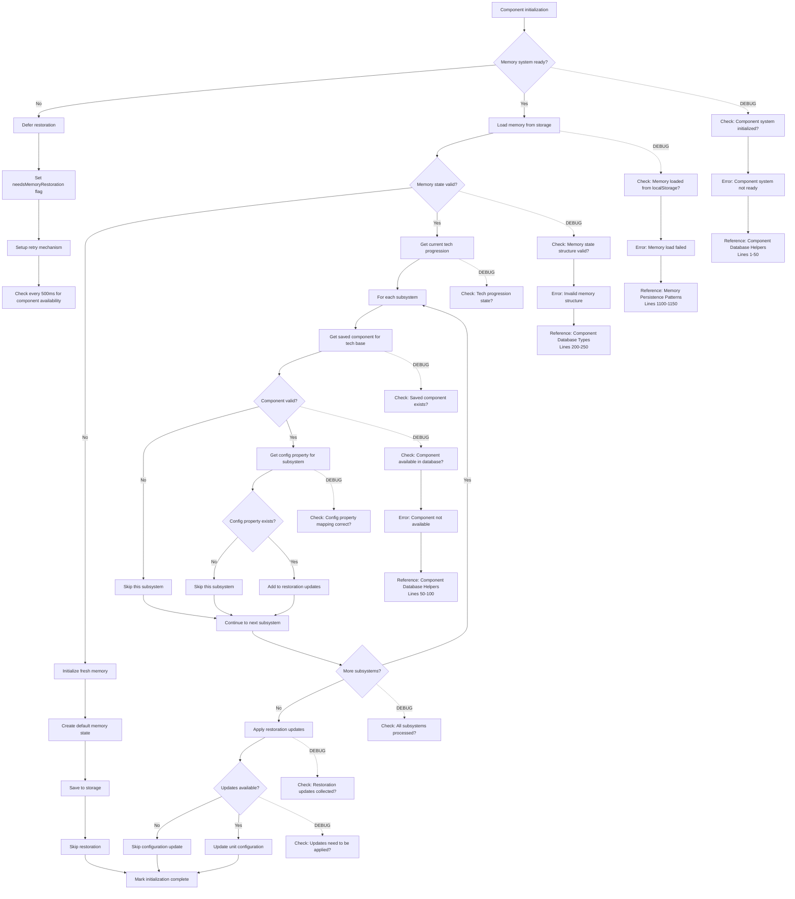
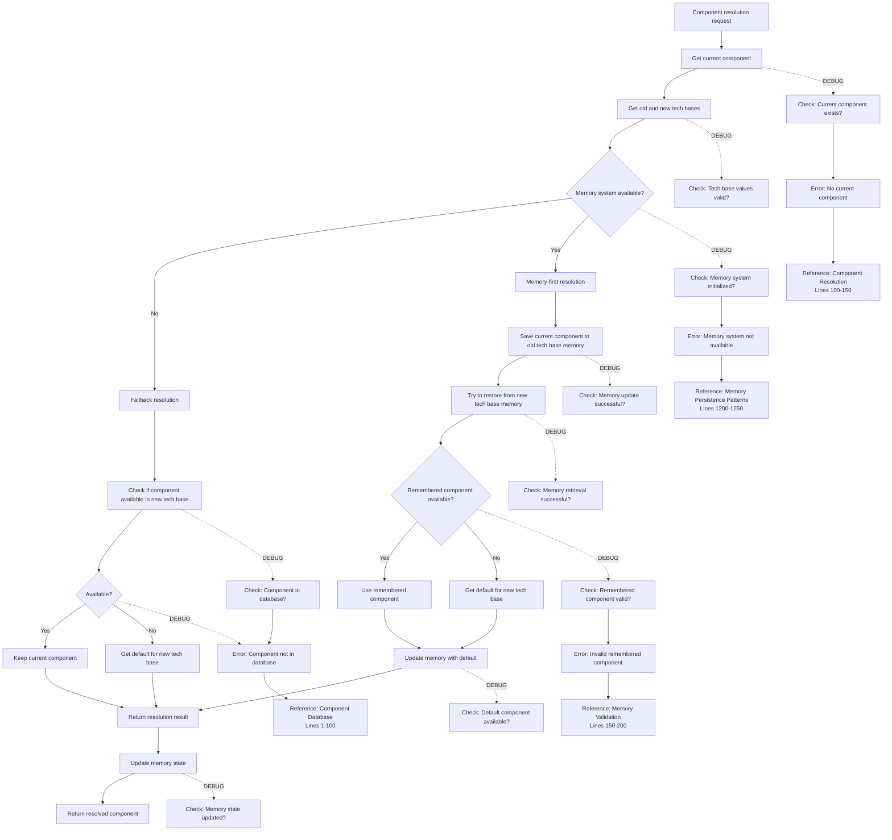
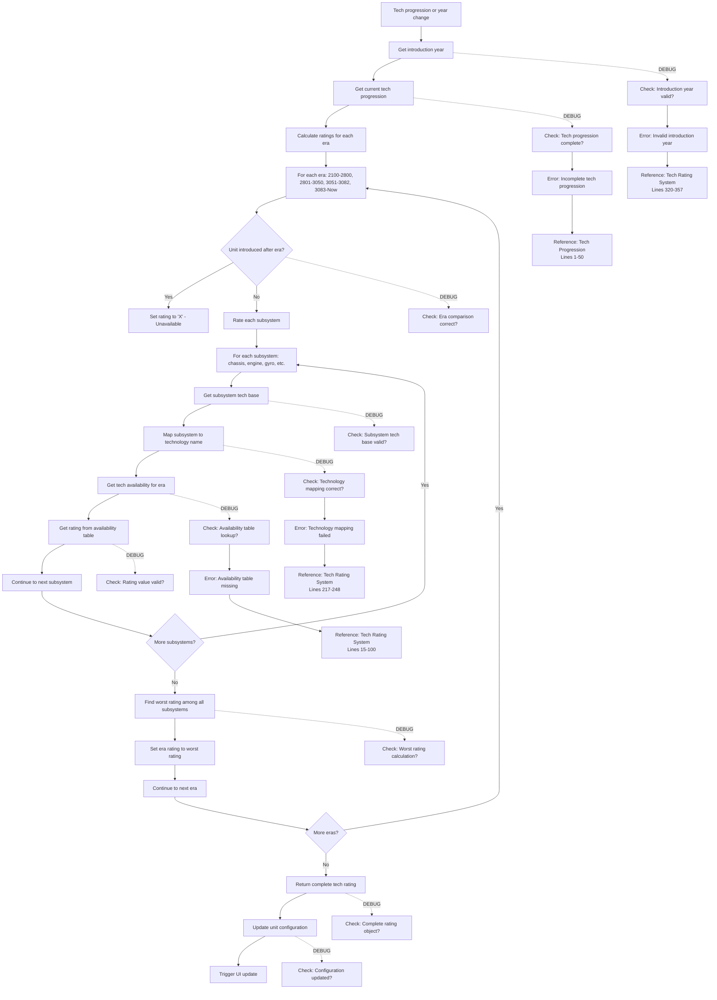

# BattleTech Customizer Architecture Analysis

## Overview

This document provides a comprehensive analysis of how the BattleTech customizer works, focusing on the event flow between tabs, data synchronization, and the unified effect system. The analysis covers the core logic of how the customizer and all tabs work together to provide one unified effect.

## Implementation Instructions for Future Refactored Version

This document serves as a complete implementation guide for rebuilding the customizer with proper TypeScript types, consistent state management, and reliable UI input/output handling. Each section includes specific implementation patterns to ensure UI consistency and state synchronization.

## Tech Progression Interaction Flow Diagrams

### 1. Individual Subsystem Tech Toggle Flow



### 2. Master Tech Base Dropdown Flow



### 3. Tech Progression Memory Restoration Flow



### 4. Component Resolution with Memory Flow



### 5. Tech Rating Auto-Calculation Flow



### Debugging Reference Guide

#### Checkpoint Details

**B1 - Component System Initialization**
- Verify `ALL_EQUIPMENT_VARIANTS` is loaded
- Check component database helpers are available
- Reference: `utils/componentDatabaseHelpers.ts` Lines 1-50

**D1 - Memory System State**
- Check `localStorage` for memory data
- Verify memory state structure matches expected format
- Reference: `utils/memoryPersistence.ts` Lines 1100-1150

**L1 - Component Availability**
- Check component exists in database for tech base
- Verify rules level compatibility
- Reference: `utils/componentDatabaseHelpers.ts` Lines 50-100

**W1 - Atomic Update Validation**
- Verify all changes applied in single transaction
- Check no partial state updates occurred
- Reference: `components/overview/OverviewTabV2.tsx` Lines 425-550

**T1 - Tech Rating Calculation**
- Verify all eras processed
- Check rating values are valid (A-F, X)
- Reference: `utils/techRating.ts` Lines 320-357

#### Common Error Scenarios

1. **Memory System Not Initialized**
   - Solution: Implement proper initialization sequence
   - Reference: Memory Persistence Patterns (Lines 1200-1250)

2. **Component Not Available in Tech Base**
   - Solution: Check component database and availability
   - Reference: Component Database Helpers (Lines 50-100)

3. **Invalid Tech Progression State**
   - Solution: Validate tech progression structure
   - Reference: Tech Progression (Lines 1-50)

4. **Atomic Update Failure**
   - Solution: Implement proper state management patterns
   - Reference: State Management Patterns (Lines 800-850)

## Net Effects on All Tabs and Components

### 1. Structure Tab Effects

**IMPLEMENTATION INSTRUCTION:** The Structure Tab must react to tech progression changes by updating component options and recalculating weights.

#### Engine Subsystem Changes
```typescript
// When techProgression.engine changes from 'Inner Sphere' to 'Clan'
// Structure Tab Effects:

// 1. Engine Type Dropdown Options Update
const engineOptions = getFilteredEngineOptions(techProgression.engine, rulesLevel)
// Inner Sphere: ['Standard', 'XL', 'Light', 'Compact', 'ICE', 'Fuel Cell']
// Clan: ['Standard', 'XL', 'Light', 'XXL', 'Compact']

// 2. Engine Weight Recalculation
const engineWeight = calculateEngineWeight(engineType, engineRating, techProgression.engine)
// Clan engines are typically lighter than Inner Sphere equivalents

// 3. Heat Sink Integration Recalculation
const integratedHeatSinks = calculateIntegratedHeatSinks(engineRating, techProgression.engine)
// Clan engines may have different integration ratios

// 4. Critical Slot Requirements Update
const engineSlots = getEngineCriticalSlots(engineType, techProgression.engine)
// Different tech bases may have different slot requirements
```

#### Gyro Subsystem Changes
```typescript
// When techProgression.gyro changes from 'Inner Sphere' to 'Clan'
// Structure Tab Effects:

// 1. Gyro Type Dropdown Options Update
const gyroOptions = getFilteredGyroOptions(techProgression.gyro, rulesLevel)
// Inner Sphere: ['Standard', 'XL', 'Compact', 'Heavy-Duty']
// Clan: ['Standard', 'XL', 'Compact']

// 2. Gyro Weight Recalculation
const gyroWeight = calculateGyroWeight(gyroType, techProgression.gyro)
// Clan gyros may have different weight characteristics

// 3. Critical Slot Requirements Update
const gyroSlots = getGyroCriticalSlots(gyroType, techProgression.gyro)
// Different tech bases may have different slot requirements

// 4. Engine Compatibility Check
const isCompatible = checkEngineGyroCompatibility(engineType, gyroType, techProgression)
// XL gyro may not be compatible with certain engine types
```

#### Heat Sink Subsystem Changes
```typescript
// When techProgression.heatsink changes from 'Inner Sphere' to 'Clan'
// Structure Tab Effects:

// 1. Heat Sink Type Dropdown Options Update
const heatSinkOptions = getFilteredHeatSinkOptions(techProgression.heatsink, rulesLevel)
// Inner Sphere: ['Single', 'Double', 'Compact', 'Laser']
// Clan: ['Single', 'Double (Clan)', 'Compact', 'Laser']

// 2. Heat Sink Weight Recalculation
const heatSinkWeight = calculateHeatSinkWeight(heatSinkType, techProgression.heatsink)
// Clan heat sinks may have different weight characteristics

// 3. Heat Sink Efficiency Recalculation
const heatSinkEfficiency = calculateHeatSinkEfficiency(heatSinkType, techProgression.heatsink)
// Clan heat sinks may be more efficient

// 4. Critical Slot Requirements Update
const heatSinkSlots = getHeatSinkCriticalSlots(heatSinkType, techProgression.heatsink)
// Different tech bases may have different slot requirements
```

### 2. Armor Tab Effects

**IMPLEMENTATION INSTRUCTION:** The Armor Tab must react to tech progression changes by updating armor options and recalculating maximum armor capacity.

#### Armor Subsystem Changes
```typescript
// When techProgression.armor changes from 'Inner Sphere' to 'Clan'
// Armor Tab Effects:

// 1. Armor Type Dropdown Options Update
const armorOptions = getFilteredArmorOptions(techProgression.armor, rulesLevel)
// Inner Sphere: ['Standard', 'Ferro-Fibrous', 'Heavy Ferro-Fibrous', 'Stealth']
// Clan: ['Standard', 'Ferro-Fibrous', 'Ferro-Lamellor', 'Stealth']

// 2. Maximum Armor Capacity Recalculation
const maxArmorTonnage = calculateMaxArmorTonnage(unitTonnage, armorType, techProgression.armor)
// Clan armor may have different maximum capacity ratios

// 3. Armor Weight Recalculation
const armorWeight = calculateArmorWeight(armorTonnage, armorType, techProgression.armor)
// Clan armor may have different weight characteristics

// 4. Armor Allocation Validation
const isValidAllocation = validateArmorAllocation(armorAllocation, maxArmorTonnage)
// Check if current allocation exceeds new maximum

// 5. Critical Slot Requirements Update
const armorSlots = getArmorCriticalSlots(armorType, techProgression.armor)
// Different armor types may require different critical slots
```

#### Structure Subsystem Changes
```typescript
// When techProgression.chassis changes from 'Inner Sphere' to 'Clan'
// Armor Tab Effects:

// 1. Structure Type Dropdown Options Update
const structureOptions = getFilteredStructureOptions(techProgression.chassis, rulesLevel)
// Inner Sphere: ['Standard', 'Endo Steel', 'Composite', 'Reinforced']
// Clan: ['Standard', 'Endo Steel (Clan)', 'Composite', 'Reinforced']

// 2. Structure Weight Recalculation
const structureWeight = calculateStructureWeight(structureType, unitTonnage, techProgression.chassis)
// Clan structure may have different weight characteristics

// 3. Critical Slot Requirements Update
const structureSlots = getStructureCriticalSlots(structureType, techProgression.chassis)
// Different structure types may require different critical slots

// 4. Armor Capacity Impact
const armorCapacityImpact = calculateArmorCapacityImpact(structureType, techProgression.chassis)
// Some structure types may affect armor capacity
```

### 3. Critical Slots Tab Effects

**IMPLEMENTATION INSTRUCTION:** The Critical Slots Tab must react to tech progression changes by updating slot requirements and handling equipment displacement.

#### Component Slot Requirement Changes
```typescript
// When any subsystem tech progression changes
// Critical Slots Tab Effects:

// 1. Critical Slot Requirements Recalculation
const slotRequirements = calculateSlotRequirements(systemComponents, techProgression)
// Each component may have different slot requirements per tech base

// 2. Equipment Displacement Check
const displacedEquipment = checkEquipmentDisplacement(criticalAllocations, slotRequirements)
// Equipment may need to be moved if slot requirements change

// 3. Slot Availability Update
const availableSlots = calculateAvailableSlots(criticalAllocations, slotRequirements)
// Update which slots are available for equipment placement

// 4. Equipment Compatibility Check
const compatibleEquipment = filterCompatibleEquipment(unallocatedEquipment, techProgression)
// Some equipment may not be compatible with new tech base

// 5. Auto-Allocation Trigger
if (autoModeEnabled) {
  const autoAllocationResult = autoAllocateEquipment(unit, techProgression)
  // Automatically reallocate equipment based on new requirements
}
```

#### Equipment Filtering Effects
```typescript
// When tech progression changes affect equipment availability
// Critical Slots Tab Effects:

// 1. Equipment Browser Filter Update
const filteredEquipment = filterEquipmentByTechBase(allEquipment, techProgression)
// Only show equipment compatible with current tech progression

// 2. Equipment Tray Update
const compatibleEquipment = getCompatibleEquipment(unallocatedEquipment, techProgression)
// Update equipment tray with compatible items only

// 3. Equipment Displacement Handling
const displacementResult = handleEquipmentDisplacement(displacedEquipment, techProgression)
// Handle equipment that becomes incompatible with new tech base

// 4. Equipment Validation
const validationResult = validateEquipmentPlacement(equipment, location, techProgression)
// Validate that equipment can be placed in current tech base
```

### 4. Equipment Tab Effects

**IMPLEMENTATION INSTRUCTION:** The Equipment Tab must react to tech progression changes by updating available equipment and filtering options.

#### Equipment Availability Changes
```typescript
// When tech progression changes
// Equipment Tab Effects:

// 1. Equipment Database Filter Update
const availableEquipment = filterEquipmentDatabase(allEquipment, techProgression, rulesLevel)
// Filter equipment based on tech base and rules level

// 2. Equipment Category Updates
const equipmentCategories = updateEquipmentCategories(categories, techProgression)
// Some categories may be empty or have different items

// 3. Equipment Search Results Update
const searchResults = filterSearchResults(searchQuery, availableEquipment, techProgression)
// Update search results based on tech base compatibility

// 4. Equipment Details Update
const equipmentDetails = getEquipmentDetails(equipmentId, techProgression)
// Equipment characteristics may vary by tech base

// 5. Equipment Validation
const validationResult = validateEquipmentSelection(equipment, unit, techProgression)
// Validate that selected equipment is compatible
```

#### Equipment Characteristics Changes
```typescript
// When equipment characteristics change due to tech base
// Equipment Tab Effects:

// 1. Equipment Weight Updates
const equipmentWeight = calculateEquipmentWeight(equipment, techProgression)
// Equipment weight may vary by tech base

// 2. Equipment Critical Slot Updates
const equipmentSlots = getEquipmentCriticalSlots(equipment, techProgression)
// Equipment may require different number of slots

// 3. Equipment Heat Generation Updates
const equipmentHeat = calculateEquipmentHeat(equipment, techProgression)
// Equipment heat generation may vary by tech base

// 4. Equipment Damage Updates
const equipmentDamage = calculateEquipmentDamage(equipment, techProgression)
// Equipment damage may vary by tech base

// 5. Equipment Range Updates
const equipmentRange = calculateEquipmentRange(equipment, techProgression)
// Equipment range may vary by tech base
```

### 5. Weight Summary Effects

**IMPLEMENTATION INSTRUCTION:** The Weight Summary must react to tech progression changes by recalculating all component weights.

#### Component Weight Recalculations
```typescript
// When tech progression changes affect component weights
// Weight Summary Effects:

// 1. Engine Weight Recalculation
const engineWeight = calculateEngineWeight(engineType, engineRating, techProgression.engine)
// Update engine weight based on tech base

// 2. Gyro Weight Recalculation
const gyroWeight = calculateGyroWeight(gyroType, techProgression.gyro)
// Update gyro weight based on tech base

// 3. Structure Weight Recalculation
const structureWeight = calculateStructureWeight(structureType, unitTonnage, techProgression.chassis)
// Update structure weight based on tech base

// 4. Armor Weight Recalculation
const armorWeight = calculateArmorWeight(armorTonnage, armorType, techProgression.armor)
// Update armor weight based on tech base

// 5. Heat Sink Weight Recalculation
const heatSinkWeight = calculateHeatSinkWeight(heatSinkType, techProgression.heatsink)
// Update heat sink weight based on tech base

// 6. Total Weight Recalculation
const totalWeight = calculateTotalWeight(systemComponents, equipment, techProgression)
// Recalculate total weight with all updated components

// 7. Weight Distribution Update
const weightDistribution = calculateWeightDistribution(totalWeight, unitTonnage)
// Update weight distribution percentages
```

### 6. Validation System Effects

**IMPLEMENTATION INSTRUCTION:** The Validation System must react to tech progression changes by updating validation rules and error messages.

#### Validation Rule Updates
```typescript
// When tech progression changes
// Validation System Effects:

// 1. Component Compatibility Validation
const compatibilityValidation = validateComponentCompatibility(systemComponents, techProgression)
// Check if all components are compatible with current tech base

// 2. Equipment Compatibility Validation
const equipmentValidation = validateEquipmentCompatibility(equipment, techProgression)
// Check if all equipment is compatible with current tech base

// 3. Critical Slot Validation
const slotValidation = validateCriticalSlots(criticalAllocations, systemComponents, techProgression)
// Validate that critical slot requirements are met

// 4. Weight Validation
const weightValidation = validateWeight(totalWeight, unitTonnage, techProgression)
// Validate that weight limits are not exceeded

// 5. Heat Validation
const heatValidation = validateHeat(heatGeneration, heatDissipation, techProgression)
// Validate that heat management is adequate

// 6. Tech Rating Validation
const techRatingValidation = validateTechRating(techRating, introductionYear, techProgression)
// Validate that tech rating is appropriate for era and tech base
```

### 7. Export/Import System Effects

**IMPLEMENTATION INSTRUCTION:** The Export/Import System must react to tech progression changes by updating data formats and validation.

#### Data Format Updates
```typescript
// When tech progression changes affect data structure
// Export/Import System Effects:

// 1. Export Format Update
const exportData = generateExportData(unit, techProgression)
// Include tech progression information in export

// 2. Import Validation Update
const importValidation = validateImportData(importData, techProgression)
// Validate that imported data is compatible with current tech base

// 3. Data Migration
const migratedData = migrateDataFormat(oldData, newTechProgression)
// Migrate data from old tech base to new tech base

// 4. Compatibility Check
const compatibilityCheck = checkDataCompatibility(data, techProgression)
// Check if data is compatible with current tech base

// 5. Error Reporting
const errorReport = generateErrorReport(validationErrors, techProgression)
// Generate error reports specific to tech base issues
```

### 8. UI Component Effects

**IMPLEMENTATION INSTRUCTION:** All UI components must react to tech progression changes by updating their display and behavior.

#### Dropdown Component Updates
```typescript
// When tech progression changes affect dropdown options
// UI Component Effects:

// 1. Dropdown Options Update
const dropdownOptions = getFilteredDropdownOptions(options, techProgression)
// Filter dropdown options based on tech base

// 2. Dropdown Value Validation
const isValidValue = validateDropdownValue(value, techProgression)
// Validate that current value is still valid

// 3. Dropdown Disabled State
const isDisabled = checkDropdownDisabled(techProgression, rulesLevel)
// Disable dropdown if no valid options available

// 4. Dropdown Tooltip Update
const tooltipText = generateDropdownTooltip(techProgression, rulesLevel)
// Update tooltip with tech base specific information
```

#### Form Component Updates
```typescript
// When tech progression changes affect form validation
// UI Component Effects:

// 1. Form Validation Rules Update
const validationRules = getValidationRules(field, techProgression)
// Update validation rules based on tech base

// 2. Form Error Messages Update
const errorMessages = getErrorMessages(validationErrors, techProgression)
// Update error messages with tech base specific information

// 3. Form Field Requirements Update
const fieldRequirements = getFieldRequirements(field, techProgression)
// Update field requirements based on tech base

// 4. Form Field Visibility Update
const isVisible = checkFieldVisibility(field, techProgression)
// Show/hide fields based on tech base compatibility
```

### 9. State Management Effects

**IMPLEMENTATION INSTRUCTION:** The State Management system must react to tech progression changes by updating state structure and validation.

#### State Structure Updates
```typescript
// When tech progression changes affect state structure
// State Management Effects:

// 1. State Validation Update
const stateValidation = validateStateStructure(state, techProgression)
// Validate that state structure is compatible with tech base

// 2. State Migration
const migratedState = migrateState(state, oldTechProgression, newTechProgression)
// Migrate state from old tech base to new tech base

// 3. State Cleanup
const cleanedState = cleanupState(state, techProgression)
// Remove invalid state entries for current tech base

// 4. State Initialization
const initializedState = initializeState(techProgression)
// Initialize state with default values for tech base

// 5. State Persistence Update
const persistenceData = prepareStateForPersistence(state, techProgression)
// Prepare state for persistence with tech base information
```

### 10. Performance Optimization Effects

**IMPLEMENTATION INSTRUCTION:** Performance optimizations must account for tech progression changes to maintain responsiveness.

#### Caching Strategy Updates
```typescript
// When tech progression changes affect cached data
// Performance Optimization Effects:

// 1. Cache Invalidation
const invalidatedCache = invalidateCache(cacheKey, techProgression)
// Invalidate cache entries that depend on tech base

// 2. Cache Key Update
const newCacheKey = generateCacheKey(data, techProgression)
// Update cache keys to include tech base information

// 3. Cache Warming
const warmedCache = warmCache(techProgression)
// Pre-populate cache with tech base specific data

// 4. Lazy Loading Update
const lazyLoadData = lazyLoadTechBaseData(techProgression)
// Lazy load data specific to current tech base

// 5. Debouncing Update
const debouncedUpdate = debounceTechBaseUpdate(updateFunction, techProgression)
// Debounce updates that depend on tech base changes
```

## Cross-Tab Synchronization Requirements

### 1. Immediate Update Requirements

**CRITICAL:** The following tabs must update immediately when tech progression changes:

- **Structure Tab**: Component options, weights, critical slots
- **Armor Tab**: Armor options, maximum capacity, weight
- **Critical Slots Tab**: Slot requirements, equipment displacement
- **Equipment Tab**: Available equipment, filtering options
- **Weight Summary**: All component weights, total weight

### 2. Deferred Update Requirements

**CRITICAL:** The following tabs may update after a brief delay:

- **Validation System**: Comprehensive validation checks
- **Export/Import System**: Data format updates
- **Performance Optimizations**: Cache invalidation and warming

### 3. Error Handling Requirements

**CRITICAL:** All tabs must handle tech progression errors gracefully:

- **Fallback to Previous State**: If tech progression change fails
- **User Notification**: Clear error messages about incompatibilities
- **Recovery Options**: Provide options to resolve conflicts
- **Data Preservation**: Preserve user data during tech base transitions

## File Architecture and Linkages

### Core State Management Files

```
battletech-editor-app/
├── components/
│   ├── multiUnit/
│   │   ├── MultiUnitProvider.tsx          # Main state provider
│   │   ├── TabManager.tsx                 # Tab management UI
│   │   └── NewTabModal.tsx                # New tab creation
│   ├── overview/
│   │   └── OverviewTabV2.tsx              # Tech progression control
│   └── criticalSlots/
│       ├── EnhancedCriticalSlotsDisplay.tsx  # Main critical slots UI
│       ├── CriticalSlotsDisplay.tsx          # Individual slot display
│       ├── UnallocatedEquipmentDisplay.tsx   # Equipment pool display
│       ├── CriticalSlotsToolbar.tsx          # Auto-mode controls
│       └── EquipmentTray.tsx                 # Equipment management
├── hooks/
│   └── useUnitData.tsx                    # Unified data hook
├── utils/
│   ├── componentSync.ts                   # Component synchronization
│   ├── techProgression.ts                 # Tech progression logic
│   ├── techProgressionFiltering.ts        # Component filtering
│   ├── memoryPersistence.ts               # State persistence
│   ├── DebouncedSaveManager.ts            # Save management
│   └── criticalSlots/
│       ├── CriticalSlotsManagementService.ts # Slot management operations
│       ├── CriticalSlot.ts                # Individual slot logic
│       └── UnitCriticalManager.ts         # Unit-level slot management
└── types/
    ├── editor.ts                          # Core data types
    ├── systemComponents.ts                # Component definitions
    └── componentDatabase.ts               # Component database
```

### Implementation Pattern: State Provider Architecture

**CRITICAL IMPLEMENTATION REQUIREMENT:** The state provider must implement a single source of truth pattern with proper TypeScript types and immutable state updates.

```typescript
// Implementation Pattern: MultiUnitProvider.tsx
interface MultiUnitState {
  tabs: TabUnit[]
  activeTabId: string | null
  nextTabNumber: number
}

interface TabUnit {
  id: string
  name: string
  unitManager: UnitCriticalManager
  stateManager: UnitStateManager
  created: Date
  modified: Date
  isModified: boolean
}

// CRITICAL: Use useReducer for complex state management
const [state, dispatch] = useReducer(multiUnitReducer, initialState)

// CRITICAL: Implement proper action types
type MultiUnitAction = 
  | { type: 'CREATE_TAB'; payload: { name: string; config?: UnitConfiguration } }
  | { type: 'SET_ACTIVE_TAB'; payload: { tabId: string } }
  | { type: 'UPDATE_TAB_CONFIG'; payload: { tabId: string; config: UnitConfiguration } }
  | { type: 'CLOSE_TAB'; payload: { tabId: string } }

// CRITICAL: Ensure all state updates go through the reducer
const updateConfiguration = useCallback((config: UnitConfiguration) => {
  if (activeTab?.unitManager) {
    dispatch({ 
      type: 'UPDATE_TAB_CONFIG', 
      payload: { tabId: activeTab.id, config } 
    })
  }
}, [activeTab])
```

### Data Model Linkages

#### 1. MultiUnitProvider → UnitDataProvider → Component Sync

**IMPLEMENTATION INSTRUCTION:** This linkage must be implemented with proper TypeScript interfaces and immutable state updates.

```typescript
// Implementation Pattern: MultiUnitProvider.tsx
export interface TabUnit {
  id: string
  name: string
  unitManager: UnitCriticalManager
  stateManager: UnitStateManager
  created: Date
  modified: Date
  isModified: boolean
}

// CRITICAL: Implement proper context value with TypeScript types
interface MultiUnitContextValue {
  // State
  tabs: TabUnit[]
  activeTab: TabUnit | null
  activeTabId: string | null
  
  // Tab management
  createTab: (name?: string, config?: UnitConfiguration) => string
  closeTab: (tabId: string) => void
  setActiveTab: (tabId: string) => void
  
  // Active tab unit operations
  unit: UnitCriticalManager | null
  updateConfiguration: (config: UnitConfiguration) => void
  addEquipmentToUnit: (equipment: EquipmentObject) => void
  removeEquipment: (equipmentGroupId: string) => boolean
  selectEquipment: (equipmentGroupId: string | null) => void
  assignSelectedEquipment: (location: string, slotIndex: number) => boolean
  
  // State indicators
  isConfigLoaded: boolean
  unallocatedEquipment: EquipmentAllocation[]
  selectedEquipmentId: string | null
}

// CRITICAL: Implement immutable state updates
const updateConfiguration = useCallback((config: UnitConfiguration) => {
  if (activeTab?.unitManager) {
    // CRITICAL: Use immutable update pattern
    const updatedTab = {
      ...activeTab,
      unitManager: activeTab.unitManager.updateConfiguration(config),
      isModified: true,
      modified: new Date()
    }
    
    dispatch({ 
      type: 'UPDATE_TAB', 
      payload: { tabId: activeTab.id, updatedTab } 
    })
    
    // CRITICAL: Schedule save with debouncing
    scheduleSave(activeTab.id)
  }
}, [activeTab, scheduleSave])
```

#### 2. UnitDataProvider → Component Sync → Critical Slots

**IMPLEMENTATION INSTRUCTION:** This reducer pattern must be implemented with proper TypeScript types and validation.

```typescript
// Implementation Pattern: useUnitData.tsx
interface UnitState {
  unit: EditableUnit
  isDirty: boolean
  lastAction: UnitActionType | null
  validationState: ValidationState
}

// CRITICAL: Define all action types with proper payloads
enum UnitActionType {
  UPDATE_ENGINE = 'UPDATE_ENGINE',
  UPDATE_GYRO = 'UPDATE_GYRO',
  UPDATE_STRUCTURE = 'UPDATE_STRUCTURE',
  UPDATE_ARMOR = 'UPDATE_ARMOR',
  UPDATE_HEAT_SINKS = 'UPDATE_HEAT_SINKS',
  UPDATE_TECH_PROGRESSION = 'UPDATE_TECH_PROGRESSION',
  UPDATE_CRITICAL_ALLOCATIONS = 'UPDATE_CRITICAL_ALLOCATIONS',
  SET_UNIT = 'SET_UNIT',
  RESET_UNIT = 'RESET_UNIT'
}

type UnitAction = 
  | { type: UnitActionType.UPDATE_ENGINE; payload: { type: EngineType; rating: number } }
  | { type: UnitActionType.UPDATE_GYRO; payload: { type: GyroType } }
  | { type: UnitActionType.UPDATE_STRUCTURE; payload: { type: StructureType } }
  | { type: UnitActionType.UPDATE_ARMOR; payload: { type: ArmorType } }
  | { type: UnitActionType.UPDATE_HEAT_SINKS; payload: { type: HeatSinkType; count: number } }
  | { type: UnitActionType.UPDATE_TECH_PROGRESSION; payload: TechProgression }
  | { type: UnitActionType.UPDATE_CRITICAL_ALLOCATIONS; payload: Record<string, CriticalSlot[]> }
  | { type: UnitActionType.SET_UNIT; payload: EditableUnit }
  | { type: UnitActionType.RESET_UNIT; payload?: UnitConfiguration }

// CRITICAL: Implement reducer with proper validation
function unitReducer(state: UnitState, action: UnitAction): UnitState {
  switch (action.type) {
    case UnitActionType.UPDATE_ENGINE: {
      // CRITICAL: Validate input before processing
      if (!isValidEngineType(action.payload.type)) {
        console.error('Invalid engine type:', action.payload.type)
        return state
      }
      
      if (!isValidEngineRating(action.payload.rating)) {
        console.error('Invalid engine rating:', action.payload.rating)
        return state
      }
      
      // CRITICAL: Use component sync for coordinated updates
      const updates = syncEngineChange(
        state.unit,
        action.payload.type,
        action.payload.rating
      );
      
      // CRITICAL: Validate sync results
      if (!updates.success) {
        console.error('Engine sync failed:', updates.errors)
        return state
      }
      
      return {
        ...state,
        unit: {
          ...state.unit,
          systemComponents: {
            ...state.unit.systemComponents,
            engine: updates.systemComponents.engine
          },
          criticalAllocations: updates.criticalAllocations,
          data: {
            ...state.unit.data,
            engine: updates.data.engine,
            weapons_and_equipment: updates.data.weapons_and_equipment,
            criticals: updates.data.criticals,
          },
          editorMetadata: {
            ...state.unit.editorMetadata,
            lastModified: new Date(),
            isDirty: true,
          },
        },
        isDirty: true,
        lastAction: action.type,
        validationState: validateUnitState(updates.unit)
      };
    }
    
    // CRITICAL: Implement all other action types similarly
    case UnitActionType.UPDATE_GYRO: {
      const updates = syncGyroChange(state.unit, action.payload.type)
      return {
        ...state,
        unit: {
          ...state.unit,
          systemComponents: {
            ...state.unit.systemComponents,
            gyro: updates.systemComponents.gyro
          },
          criticalAllocations: updates.criticalAllocations,
          data: {
            ...state.unit.data,
            gyro: updates.data.gyro,
            weapons_and_equipment: updates.data.weapons_and_equipment,
            criticals: updates.data.criticals,
          },
          editorMetadata: {
            ...state.unit.editorMetadata,
            lastModified: new Date(),
            isDirty: true,
          },
        },
        isDirty: true,
        lastAction: action.type,
        validationState: validateUnitState(updates.unit)
      };
    }
    
    default:
      return state
  }
}
```

#### 3. Overview Tab → Tech Progression → Component Filtering

**IMPLEMENTATION INSTRUCTION:** The Overview Tab must implement proper state synchronization with memory persistence and component resolution.

```typescript
// Implementation Pattern: OverviewTabV2.tsx
interface OverviewTabState {
  techProgression: TechProgression
  introductionYear: number
  rulesLevel: RulesLevel
  techRating: TechRating
  memoryState: ComponentMemoryState | null
  hasInitialized: boolean
  needsMemoryRestoration: boolean
}

// CRITICAL: Implement proper state management with useReducer
const [state, dispatch] = useReducer(overviewTabReducer, initialState)

// CRITICAL: Define action types for overview tab
type OverviewTabAction = 
  | { type: 'UPDATE_TECH_PROGRESSION'; payload: { subsystem: keyof TechProgression; techBase: TechBase } }
  | { type: 'UPDATE_INTRODUCTION_YEAR'; payload: number }
  | { type: 'UPDATE_RULES_LEVEL'; payload: RulesLevel }
  | { type: 'SET_MEMORY_STATE'; payload: ComponentMemoryState }
  | { type: 'SET_INITIALIZED'; payload: boolean }
  | { type: 'SET_NEEDS_MEMORY_RESTORATION'; payload: boolean }

// CRITICAL: Implement tech progression change handler
const handleTechProgressionChange = useCallback((
  subsystem: keyof TechProgression, 
  newTechBase: TechBase
) => {
  console.log(`[OverviewTab] Tech progression change: ${subsystem} → ${newTechBase}`)
  
  // CRITICAL: Get current state from unit manager
  const currentConfig = unit.getConfiguration()
  const oldTechBase = currentConfig.techProgression[subsystem]
  const currentComponent = getCurrentComponentForSubsystem(subsystem, currentConfig)
  
  // CRITICAL: Memory-first component resolution
  let componentToApply = currentComponent
  let updatedMemoryState = state.memoryState
  
  if (state.memoryState && oldTechBase !== newTechBase) {
    const resolution = validateAndResolveComponentWithMemory(
      currentComponent,
      subsystem as ComponentCategory,
      oldTechBase,
      newTechBase,
      state.memoryState.techBaseMemory,
      currentConfig.rulesLevel
    )
    
    console.log(`[OverviewTab] Memory resolution: ${resolution.resolutionReason}`)
    console.log(`[OverviewTab] Component change: ${currentComponent} → ${resolution.resolvedComponent}`)
    
    // CRITICAL: Update memory state
    updatedMemoryState = updateMemoryState(state.memoryState, resolution.updatedMemory)
    componentToApply = resolution.resolvedComponent
  }
  
  // CRITICAL: Update tech progression
  const newProgression = updateTechProgression(currentConfig.techProgression, subsystem, newTechBase)
  
  // CRITICAL: Auto-update tech rating
  const newTechRating = autoUpdateTechRating(currentConfig.introductionYear, newProgression, currentConfig)
  
  // CRITICAL: Prepare component configuration update
  let componentConfig = {}
  if (componentToApply !== currentComponent) {
    const configProperty = getConfigPropertyForSubsystem(subsystem)
    if (configProperty) {
      componentConfig = { [configProperty]: componentToApply }
      
      // CRITICAL: Special handling for armor tonnage preservation
      if (subsystem === 'armor' && 'armorTonnage' in currentConfig) {
        const currentArmorTonnage = currentConfig.armorTonnage || 0
        const newMaxArmorTonnage = calculateMaxArmorTonnage(currentConfig.tonnage, componentToApply)
        const preservedArmorTonnage = Math.min(currentArmorTonnage, newMaxArmorTonnage)
        componentConfig = { ...componentConfig, armorTonnage: preservedArmorTonnage }
      }
    }
  }
  
  // CRITICAL: Apply all changes together
  const finalConfig = { 
    techProgression: newProgression,
    techRating: newTechRating,
    ...componentConfig
  }
  
  // CRITICAL: Update unit configuration
  updateConfiguration(finalConfig)
  
  // CRITICAL: Update local state
  dispatch({ 
    type: 'UPDATE_TECH_PROGRESSION', 
    payload: { subsystem, techBase: newTechBase } 
  })
  
  if (updatedMemoryState !== state.memoryState) {
    dispatch({ type: 'SET_MEMORY_STATE', payload: updatedMemoryState })
    saveMemoryToStorage(updatedMemoryState)
  }
  
  console.log(`[OverviewTab] Tech progression update completed:`, finalConfig)
}, [unit, state.memoryState, updateConfiguration])

// CRITICAL: Implement memory restoration on initialization
useEffect(() => {
  if (!state.hasInitialized && isConfigLoaded && unit) {
    console.log('[OverviewTab] Initializing memory system and restoration')
    
    // CRITICAL: Initialize memory system
    const initialMemoryState = initializeMemorySystem()
    
    // CRITICAL: Apply memory restoration
    const restorationUpdates = applyMemoryRestoration(currentConfig, initialMemoryState)
    
    if (restorationUpdates._needsMemoryRestoration) {
      dispatch({ type: 'SET_NEEDS_MEMORY_RESTORATION', payload: true })
    } else {
      updateConfiguration({ ...currentConfig, ...restorationUpdates })
    }
    
    dispatch({ type: 'SET_MEMORY_STATE', payload: initialMemoryState })
    dispatch({ type: 'SET_INITIALIZED', payload: true })
  }
}, [isConfigLoaded, state.hasInitialized, unit, updateConfiguration])
```

## Critical Slots Tab Implementation Instructions

### 1. Critical Slots State Management Architecture

**IMPLEMENTATION INSTRUCTION:** The Critical Slots tab must implement a sophisticated state management system that handles equipment allocation, slot management, and real-time UI updates.

```typescript
// Implementation Pattern: EnhancedCriticalSlotsDisplay.tsx
interface CriticalSlotsState {
  toolbarState: CriticalSlotsToolbarState
  forceUpdateTrigger: number
  prevUnallocatedEquipment: EquipmentAllocation[]
  prevSelectedEquipmentId: string | null
}

// CRITICAL: Implement proper state management
const [state, dispatch] = useReducer(criticalSlotsReducer, initialState)

// CRITICAL: Define action types for critical slots
type CriticalSlotsAction = 
  | { type: 'UPDATE_TOOLBAR_STATE'; payload: Partial<CriticalSlotsToolbarState> }
  | { type: 'FORCE_UPDATE'; payload: number }
  | { type: 'UPDATE_PREV_EQUIPMENT'; payload: EquipmentAllocation[] }
  | { type: 'UPDATE_PREV_SELECTED'; payload: string | null }

// CRITICAL: Implement auto-mode reactive behavior
useEffect(() => {
  if (!unit) return
  
  const currentToolbarState = getToolbarState()
  
  // CRITICAL: Skip auto-actions if no auto modes are enabled
  if (!currentToolbarState.autoFillUnhittables && 
      !currentToolbarState.autoCompact && 
      !currentToolbarState.autoSort) {
    return
  }

  // CRITICAL: Check if equipment state has changed
  const unallocatedChanged = JSON.stringify(unallocatedEquipment) !== JSON.stringify(state.prevUnallocatedEquipment)
  const selectedChanged = selectedEquipmentId !== state.prevSelectedEquipmentId

  if (unallocatedChanged || selectedChanged) {
    console.log('[CriticalSlots] Equipment state changed, checking auto-modes')
    
    // CRITICAL: Small delay to allow React state to settle
    const timeoutId = setTimeout(() => {
      if (!unit) return
      
      // CRITICAL: Execute auto-actions in sequence if enabled
      if (currentToolbarState.autoFillUnhittables) {
        const result = executeOperation(
          () => CriticalSlotsManagementService.fillUnhittables(unit),
          'Auto Fill Unhittables'
        )
        
        // CRITICAL: Continue with next auto-action only if this one succeeded
        if (result.success) {
          if (currentToolbarState.autoCompact) {
            const compactResult = executeOperation(
              () => CriticalSlotsManagementService.compact(unit),
              'Auto Compact'
            )
            
            if (compactResult.success && currentToolbarState.autoSort) {
              executeOperation(
                () => CriticalSlotsManagementService.sort(unit),
                'Auto Sort'
              )
            }
          } else if (currentToolbarState.autoSort) {
            executeOperation(
              () => CriticalSlotsManagementService.sort(unit),
              'Auto Sort'
            )
          }
        }
      }
    }, 100)

    return () => clearTimeout(timeoutId)
  }

  // CRITICAL: Update refs for next comparison
  dispatch({ type: 'UPDATE_PREV_EQUIPMENT', payload: [...unallocatedEquipment] })
  dispatch({ type: 'UPDATE_PREV_SELECTED', payload: selectedEquipmentId })
}, [unallocatedEquipment, selectedEquipmentId, unit, state.forceUpdateTrigger])
```

### 2. Individual Slot Management

**IMPLEMENTATION INSTRUCTION:** Each critical slot must implement proper state validation and equipment assignment logic.

```typescript
// Implementation Pattern: CriticalSlotDisplay.tsx
interface CriticalSlotDisplayProps {
  slot: CriticalSlot
  location: string
}

function CriticalSlotDisplay({ slot, location }: CriticalSlotDisplayProps) {
  const { removeEquipment, selectedEquipmentId, assignSelectedEquipment, selectEquipment, unallocatedEquipment, unit } = useUnit()

  // CRITICAL: Validate slot state
  const isEmpty = !slot.content
  const isRemovable = slot.content?.type === 'equipment'
  
  // CRITICAL: Check if this slot can accommodate the selected equipment
  const getSelectedEquipment = useCallback(() => {
    if (!selectedEquipmentId) return null
    return unallocatedEquipment.find(eq => eq.equipmentGroupId === selectedEquipmentId)
  }, [selectedEquipmentId, unallocatedEquipment])
  
  const selectedEquipment = getSelectedEquipment()
  const isAssignable = isEmpty && selectedEquipment && canAssignToSlot(slot, location, selectedEquipment)
  
  // CRITICAL: Implement slot assignment validation
  const canAssignToSlot = useCallback((targetSlot: CriticalSlot, targetLocation: string, equipment: EquipmentAllocation): boolean => {
    if (!targetSlot.isEmpty()) return false
    
    const section = unit.getSection(targetLocation)
    if (!section) return false
    
    // CRITICAL: Check location restrictions
    if (!unit.canPlaceEquipmentInLocation(equipment.equipmentData, targetLocation)) {
      return false
    }
    
    const requiredSlots = equipment.equipmentData.requiredSlots
    if (requiredSlots === 1) return true
    
    // CRITICAL: For multi-slot equipment, check consecutive empty slots
    const allSlots = section.getAllSlots()
    const startIndex = targetSlot.slotIndex
    
    for (let i = 0; i < requiredSlots; i++) {
      const slotIndex = startIndex + i
      if (slotIndex >= allSlots.length) return false
      
      const checkSlot = allSlots[slotIndex]
      if (!checkSlot.isEmpty()) return false
    }
    
    return true
  }, [unit])
  
  // CRITICAL: Implement slot click handlers
  const handleClick = useCallback(() => {
    if (isAssignable) {
      const success = assignSelectedEquipment(location, slot.slotIndex)
      if (!success) {
        console.log('Assignment failed - slot may not be suitable for this equipment')
      }
    }
  }, [isAssignable, assignSelectedEquipment, location, slot.slotIndex])
  
  const handleDoubleClick = useCallback(() => {
    if (slot.content?.type === 'equipment' && slot.content.equipmentGroupId) {
      console.log(`Double-click removing equipment: ${slot.content.equipmentGroupId}`)
      removeEquipment(slot.content.equipmentGroupId)
    }
  }, [slot.content, removeEquipment])
  
  // CRITICAL: Implement dynamic styling based on slot state
  const getSlotColorClass = useCallback((): string => {
    if (!slot.content) {
      if (isAssignable) {
        return 'bg-green-700 hover:bg-green-600 border-green-500'
      }
      return 'bg-gray-600 hover:bg-gray-500'
    }
    
    if (slot.content.type === 'system') {
      switch (slot.content.systemComponentType) {
        case 'engine': return 'bg-orange-600 hover:bg-orange-500'
        case 'gyro': return 'bg-purple-600 hover:bg-purple-500'
        case 'actuator': return 'bg-blue-600 hover:bg-blue-500'
        case 'life_support':
        case 'sensors':
        case 'cockpit': return 'bg-yellow-600 hover:bg-yellow-500'
        default: return 'bg-blue-600 hover:bg-blue-500'
      }
    }
    
    if (slot.content.type === 'equipment') {
      const equipmentType = slot.content.equipmentReference?.equipmentData?.type || 'equipment'
      switch (equipmentType) {
        case 'weapon': return 'bg-red-700 hover:bg-red-600'
        case 'ammo': return 'bg-orange-700 hover:bg-orange-600'
        case 'heat_sink': return 'bg-cyan-700 hover:bg-cyan-600'
        case 'equipment': 
        default: return 'bg-blue-700 hover:bg-blue-600'
      }
    }
    
    return 'bg-gray-600 hover:bg-gray-500'
  }, [slot.content, isAssignable])
  
  return (
    <div 
      className={`${getSlotColorClass()} text-white text-xs p-2 rounded border border-gray-500 
                 transition-colors ${getCursorClass()} ${isAssignable ? 'ring-1 ring-green-400' : ''}`}
      onClick={handleClick}
      onDoubleClick={handleDoubleClick}
      title={getTitleText()}
    >
      <div className="font-medium">
        {slot.slotIndex + 1}: {slot.getDisplayName()}
      </div>
    </div>
  )
}
```

### 3. Equipment Management Service

**IMPLEMENTATION INSTRUCTION:** The Critical Slots Management Service must implement proper slot operations with validation and error handling.

```typescript
// Implementation Pattern: CriticalSlotsManagementService.ts
export class CriticalSlotsManagementService {
  
  // CRITICAL: Implement fill operation with enhanced auto-allocation
  static fillUnhittables(unitManager: UnitCriticalManager): CriticalSlotsOperationResult {
    try {
      console.log('[CriticalSlotsManagementService] Starting enhanced fill operation')
      
      // CRITICAL: Use the enhanced auto-allocation system
      const result = unitManager.autoAllocateEquipment()
      
      return {
        success: result.success,
        message: result.message,
        slotsModified: result.slotsModified
      }
    } catch (error) {
      console.error('[CriticalSlotsManagementService] Error during enhanced fill operation:', error)
      return {
        success: false,
        message: `Error during auto-allocation: ${error}`,
        slotsModified: 0
      }
    }
  }

  // CRITICAL: Implement compact operation with smart slot management
  static compact(unitManager: UnitCriticalManager): CriticalSlotsOperationResult {
    try {
      let slotsModified = 0
      const sections = this.getAllSections(unitManager)

      for (const [locationName, section] of Object.entries(sections)) {
        if (!section) continue

        const slots = section.getAllSlots()
        const compacted = this.compactSlots(slots)
        
        if (compacted.modified) {
          // CRITICAL: Update the section with compacted slots
          this.updateSectionSlots(section, compacted.slots, unitManager)
          slotsModified += compacted.moveCount
        }
      }

      return {
        success: true,
        message: `Compacted equipment, moved ${slotsModified} components`,
        slotsModified
      }
    } catch (error) {
      console.error('Error compacting slots:', error)
      return {
        success: false,
        message: `Error compacting: ${error}`,
        slotsModified: 0
      }
    }
  }

  // CRITICAL: Implement sort operation with priority-based sorting
  static sort(unitManager: UnitCriticalManager): CriticalSlotsOperationResult {
    try {
      let slotsModified = 0
      const sections = this.getAllSections(unitManager)

      for (const [locationName, section] of Object.entries(sections)) {
        if (!section) continue

        const slots = section.getAllSlots()
        const sorted = this.sortSlots(slots)
        
        if (sorted.modified) {
          this.updateSectionSlots(section, sorted.slots, unitManager)
          slotsModified += sorted.moveCount
        }
      }

      return {
        success: true,
        message: `Sorted equipment, rearranged ${slotsModified} components`,
        slotsModified
      }
    } catch (error) {
      console.error('Error sorting slots:', error)
      return {
        success: false,
        message: `Error sorting: ${error}`,
        slotsModified: 0
      }
    }
  }

  // CRITICAL: Implement reset operation with equipment preservation
  static reset(unitManager: UnitCriticalManager): CriticalSlotsOperationResult {
    try {
      let slotsCleared = 0
      const sections = this.getAllSections(unitManager)

      for (const [locationName, section] of Object.entries(sections)) {
        if (!section) continue

        const slots = section.getAllSlots()
        
        for (const slot of slots) {
          if (this.isRemovableComponent(slot)) {
            // CRITICAL: Move equipment back to unallocated
            if (slot.content?.type === 'equipment' && slot.content.equipmentGroupId) {
              unitManager.displaceEquipment(slot.content.equipmentGroupId)
              slotsCleared++
            }
          }
        }
      }

      return {
        success: true,
        message: `Reset complete, removed ${slotsCleared} components`,
        slotsModified: slotsCleared
      }
    } catch (error) {
      console.error('Error resetting slots:', error)
      return {
        success: false,
        message: `Error resetting: ${error}`,
        slotsModified: 0
      }
    }
  }
}
```

## Detailed State Saving Behaviors

### 1. Debounced Save Manager

```typescript
// DebouncedSaveManager.ts
export class MultiTabDebouncedSaveManager {
  private saveQueue: Map<string, SaveHandler> = new Map();
  private saveTimers: Map<string, NodeJS.Timeout> = new Map();
  private readonly delay: number;

  constructor(delay: number = 1000) {
    this.delay = delay;
  }

  scheduleSave(tabId: string, saveHandler: SaveHandler): void {
    // Cancel existing timer for this tab
    const existingTimer = this.saveTimers.get(tabId);
    if (existingTimer) {
      clearTimeout(existingTimer);
    }

    // Queue the save handler
    this.saveQueue.set(tabId, saveHandler);

    // Set new timer
    const timer = setTimeout(() => {
      this.executeSave(tabId);
    }, this.delay);

    this.saveTimers.set(tabId, timer);
  }

  private executeSave(tabId: string): void {
    const saveHandler = this.saveQueue.get(tabId);
    if (saveHandler) {
      saveHandler();
      this.saveQueue.delete(tabId);
      this.saveTimers.delete(tabId);
    }
  }
}
```

### 2. Browser Event Handlers for Save Flushing

```typescript
// DebouncedSaveManager.ts - Browser Handlers
export class SaveManagerBrowserHandlers {
  private static instance: SaveManagerBrowserHandlers;
  private saveManager: MultiTabDebouncedSaveManager | null = null;

  static getInstance(): SaveManagerBrowserHandlers {
    if (!SaveManagerBrowserHandlers.instance) {
      SaveManagerBrowserHandlers.instance = new SaveManagerBrowserHandlers();
    }
    return SaveManagerBrowserHandlers.instance;
  }

  attachSaveManager(saveManager: MultiTabDebouncedSaveManager): void {
    this.saveManager = saveManager;
    
    // Flush saves on page unload
    window.addEventListener('beforeunload', this.handleBeforeUnload);
    
    // Flush saves on visibility change
    document.addEventListener('visibilitychange', this.handleVisibilityChange);
    
    // Flush saves on focus loss
    window.addEventListener('blur', this.handleBlur);
  }

  private handleBeforeUnload = (): void => {
    if (this.saveManager) {
      this.saveManager.flushAllSaves();
    }
  };

  private handleVisibilityChange = (): void => {
    if (document.visibilityState === 'hidden' && this.saveManager) {
      this.saveManager.flushAllSaves();
    }
  };

  private handleBlur = (): void => {
    if (this.saveManager) {
      this.saveManager.flushAllSaves();
    }
  };
}
```

### 3. Complete State Persistence

```typescript
// MultiUnitProvider.tsx (lines 300-350)
const saveCompleteState = (tabId: string, unitManager: UnitCriticalManager) => {
  const saveHandler = (completeState: CompleteUnitState) => {
    const enhancedData: EnhancedTabData = {
      completeState,
      modified: new Date().toISOString(),
      version: '2.0'
    };
    
    try {
      localStorage.setItem(`${COMPLETE_STATE_PREFIX}${tabId}`, JSON.stringify(enhancedData));
      console.log(`[MultiUnitProvider] Saved complete state for tab ${tabId}`);
    } catch (error) {
      console.error(`[MultiUnitProvider] Failed to save state for tab ${tabId}:`, error);
    }
  };

  saveManager.scheduleSave(tabId, saveHandler);
};

const saveCompleteStateImmediately = (tabId: string, unitManager: UnitCriticalManager) => {
  const saveHandler = (completeState: CompleteUnitState) => {
    const enhancedData: EnhancedTabData = {
      completeState,
      modified: new Date().toISOString(),
      version: '2.0'
    };
    
    try {
      localStorage.setItem(`${COMPLETE_STATE_PREFIX}${tabId}`, JSON.stringify(enhancedData));
      console.log(`[MultiUnitProvider] Immediately saved complete state for tab ${tabId}`);
    } catch (error) {
      console.error(`[MultiUnitProvider] Failed to immediately save state for tab ${tabId}:`, error);
    }
  };

  const getStateCallback = () => {
    return unitManager.getCompleteState();
  };

  // Execute immediately
  const completeState = getStateCallback();
  saveHandler(completeState);
};
```

## Expected Behaviors on Each Click

### 1. Overview Tab Tech Progression Button Click

**File:** `components/overview/OverviewTabV2.tsx`

**Click Event:** User clicks "Clan" button for "Tech/Engine" subsystem

**Expected Behavior:**
```typescript
// 1. Button click triggers handleTechProgressionChange
const handleTechProgressionChange = (subsystem: 'engine', newTechBase: 'Clan') => {
  console.log('[OverviewTab] BUTTON CLICKED: engine → Clan');
  
  // 2. Capture current state
  const oldTechBase = enhancedConfig.techProgression.engine; // 'Inner Sphere'
  const currentComponent = getCurrentComponentForSubsystem('engine', enhancedConfig); // 'Standard'
  
  // 3. Memory-first component resolution
  const resolution = validateAndResolveComponentWithMemory(
    currentComponent, // 'Standard'
    'engine',
    oldTechBase, // 'Inner Sphere'
    newTechBase, // 'Clan'
    memoryState
  );
  
  // 4. Update tech progression
  const newProgression = {
    ...enhancedConfig.techProgression,
    engine: 'Clan'
  };
  
  // 5. Auto-update tech rating
  const newTechRating = autoUpdateTechRating(enhancedConfig.introductionYear, newProgression, enhancedConfig);
  
  // 6. Update configuration
  handleConfigUpdate({
    techProgression: newProgression,
    techRating: newTechRating
  });
  
  // 7. Save memory state
  updateMemoryState(memoryState, 'engine', 'Clan', resolution.resolvedComponent);
  saveMemoryToStorage(memoryState);
};
```

**State Changes:**
- `techProgression.engine` changes from `'Inner Sphere'` to `'Clan'`
- `techRating` updates automatically based on new progression
- Memory state updates to remember Clan engine preference
- Structure Tab engine dropdown options update (same options, different characteristics)
- Equipment Tab filters Clan engine-related equipment

### 2. Structure Tab Engine Dropdown Change

**File:** `components/editor/tabs/StructureTabWithHooks.tsx`

**Click Event:** User selects "XL" from engine type dropdown

**Expected Behavior:**
```typescript
// 1. Dropdown change triggers handleEngineChange
const handleEngineChange = (field: 'type', value: 'XL') => {
  if (!systemComponents?.engine) return;
  
  // 2. Call useUnitData update method
  updateEngine('XL', systemComponents.engine.rating);
};

// 3. useUnitData dispatches UPDATE_ENGINE action
const updateEngine = useCallback((type: string, rating: number) => {
  dispatch({ type: UnitActionType.UPDATE_ENGINE, payload: { type, rating } });
}, []);

// 4. Reducer processes UPDATE_ENGINE action
case UnitActionType.UPDATE_ENGINE: {
  const updates = syncEngineChange(state.unit, 'XL', 300);
  
  // 5. Component sync calculates changes
  // - Engine weight: 300/75 * 50/50 * 0.5 = 2.0 tons (XL multiplier)
  // - Heat sinks: Recalculate engine integration
  // - Critical slots: Update engine placement
  // - Equipment: Displace conflicting equipment
  
  return {
    ...state,
    unit: {
      ...state.unit,
      systemComponents: updatedComponents,
      criticalAllocations: updatedAllocations,
      data: {
        ...state.unit.data,
        engine: { type: 'XL', rating: 300 },
        criticals: convertToLegacyCriticals(updatedAllocations),
        weapons_and_equipment: updatedEquipment,
      },
      editorMetadata: {
        ...state.unit.editorMetadata,
        lastModified: new Date(),
        isDirty: true,
      },
    },
    isDirty: true,
    lastAction: action.type,
  };
}
```

**State Changes:**
- `systemComponents.engine.type` changes to `'XL'`
- `systemComponents.engine.weight` recalculates to 2.0 tons
- `systemComponents.heatSinks.engineIntegrated` updates based on new engine rating
- `criticalAllocations` updates engine slot placement
- `data.weapons_and_equipment` updates displaced equipment locations
- `editorMetadata.isDirty` set to `true`
- Criticals Tab shows updated engine placement
- Weight summary updates with new engine weight

### 3. Structure Tab Gyro Dropdown Change

**File:** `components/editor/tabs/StructureTabWithHooks.tsx`

**Click Event:** User selects "XL" from gyro type dropdown

**Expected Behavior:**
```typescript
// 1. Dropdown change triggers updateGyro
const handleGyroChange = (value: 'XL') => {
  updateGyro(value);
};

// 2. useUnitData dispatches UPDATE_GYRO action
const updateGyro = useCallback((type: string) => {
  dispatch({ type: UnitActionType.UPDATE_GYRO, payload: { type } });
}, []);

// 3. Reducer processes UPDATE_GYRO action
case UnitActionType.UPDATE_GYRO: {
  const updates = syncGyroChange(state.unit, 'XL');
  
  // 4. Component sync validates compatibility
  if (newGyroType === 'XL') {
    const engineType = systemComponents.engine.type;
    // Check if XL gyro is compatible with current engine
    if (engineType === 'Standard' || engineType === 'ICE' || engineType === 'Fuel Cell' || engineType === 'Compact') {
      console.warn('XL Gyro is incompatible with this engine type.');
      return {}; // Return unchanged
    }
  }
  
  // 5. Smart slot update for gyro placement
  const { updatedAllocations, displacedEquipment } = smartUpdateSlots(
    criticalAllocations,
    oldGyroSlots, // Current gyro positions
    newGyroSlots, // New XL gyro positions (slots 3-8)
    'Gyro'
  );
  
  // 6. If XL gyro with compatible engine, re-place engine
  if (newGyroType === 'XL' && systemComponents.engine.type === 'XL') {
    const newEngineSlots = getEngineSlots('XL', 'XL'); // Side torso slots
    const engineResult = smartUpdateSlots(
      updatedAllocations,
      oldEngineSlots,
      newEngineSlots,
      'Engine'
    );
    
    updatedAllocations = engineResult.updatedAllocations;
    displacedEquipment = [...displacedEquipment, ...engineResult.displacedEquipment];
  }
  
  return {
    ...state,
    unit: {
      ...state.unit,
      systemComponents: updatedComponents,
      criticalAllocations: updatedAllocations,
      data: {
        ...state.unit.data,
        gyro: { type: 'XL' },
        criticals: convertToLegacyCriticals(updatedAllocations),
        weapons_and_equipment: updateDisplacedEquipment(
          unit.data?.weapons_and_equipment || [],
          displacedEquipment
        ),
      },
      editorMetadata: {
        ...state.unit.editorMetadata,
        lastModified: new Date(),
        isDirty: true,
      },
    },
    isDirty: true,
    lastAction: action.type,
  };
}
```

**State Changes:**
- `systemComponents.gyro.type` changes to `'XL'`
- `systemComponents.gyro.weight` recalculates to 1.5 tons (XL multiplier)
- `criticalAllocations` updates gyro placement to slots 3-8
- If engine is compatible XL, engine moves to side torso slots
- `data.weapons_and_equipment` updates displaced equipment
- `editorMetadata.isDirty` set to `true`
- Criticals Tab shows updated gyro and engine placement

### 4. Structure Tab Heat Sink Type Change

**File:** `components/editor/tabs/StructureTabWithHooks.tsx`

**Click Event:** User selects "Double" from heat sink type dropdown

**Expected Behavior:**
```typescript
// 1. Dropdown change triggers handleHeatSinkChange
const handleHeatSinkChange = (field: 'type', value: 'Double') => {
  if (!systemComponents?.heatSinks) return;
  
  updateHeatSinks('Double', systemComponents.heatSinks.total);
};

// 2. useUnitData dispatches UPDATE_HEAT_SINKS action
const updateHeatSinks = useCallback((type: string, count: number) => {
  dispatch({ type: UnitActionType.UPDATE_HEAT_SINKS, payload: { type, count } });
}, []);

// 3. Reducer processes UPDATE_HEAT_SINKS action
case UnitActionType.UPDATE_HEAT_SINKS: {
  const updates = syncHeatSinkChange(state.unit, 'Double', 10);
  
  // 4. Component sync updates heat sink configuration
  const updatedComponents: SystemComponents = {
    ...systemComponents,
    heatSinks: {
      type: 'Double',
      total: 10,
      engineIntegrated: calculateIntegratedHeatSinks(300), // 8
      externalRequired: calculateExternalHeatSinks(10, 300), // 2
    },
  };
  
  // 5. Update equipment list
  let updatedEquipment = unit.data?.weapons_and_equipment || [];
  
  // Remove old heat sink items
  updatedEquipment = updatedEquipment.filter(eq => 
    !eq.item_name.includes('Heat Sink') && 
    !eq.item_name.includes('Double Heat Sink')
  );
  
  // Add new heat sink items
  const externalRequired = calculateExternalHeatSinks(10, 300); // 2
  for (let i = 0; i < externalRequired; i++) {
    updatedEquipment.push({
      item_name: 'Double',
      item_type: 'equipment' as const,
      location: '', // Unallocated
      tech_base: unit.tech_base as 'IS' | 'Clan',
      tons: 0, // Heat sink weight is calculated separately
      crits: 1,
    });
  }
  
  return {
    ...state,
    unit: {
      ...state.unit,
      systemComponents: updatedComponents,
      data: {
        ...state.unit.data,
        heat_sinks: {
          type: 'Double',
          count: 10,
        },
        weapons_and_equipment: updatedEquipment,
      },
      editorMetadata: {
        ...state.unit.editorMetadata,
        lastModified: new Date(),
        isDirty: true,
      },
    },
    isDirty: true,
    lastAction: action.type,
  };
}
```

**State Changes:**
- `systemComponents.heatSinks.type` changes to `'Double'`
- `systemComponents.heatSinks.engineIntegrated` remains 8 (engine rating dependent)
- `systemComponents.heatSinks.externalRequired` remains 2 (total - engine integrated)
- `data.heat_sinks.type` changes to `'Double'`
- `data.weapons_and_equipment` updates with new heat sink items
- `editorMetadata.isDirty` set to `true`
- Equipment Tab shows new heat sink items available for placement

## Data Model Definitions

### Core Data Types

```typescript
// types/editor.ts
export interface EditableUnit {
  chassis: string;
  model: string;
  mass: number;
  tech_base: 'IS' | 'Clan' | 'Mixed';
  era: string;
  data?: {
    engine?: {
      type: string;
      rating: number;
      manufacturer?: string;
    };
    gyro?: {
      type: string;
    };
    structure?: {
      type: string;
    };
    armor?: {
      type: string;
    };
    heat_sinks?: {
      type: string;
      count: number;
    };
    weapons_and_equipment: EquipmentItem[];
    criticals: CriticalSlotLocation[];
  };
  systemComponents?: SystemComponents;
  criticalAllocations?: Record<string, CriticalSlot[]>;
  armorAllocation?: Record<string, { front: number; rear: number }>;
  editorMetadata: {
    lastModified: Date;
    isDirty: boolean;
    version: string;
  };
  validationState?: ValidationState;
}
```

### System Components

```typescript
// types/systemComponents.ts
export interface SystemComponents {
  engine: {
    type: EngineType;
    rating: number;
    manufacturer?: string;
  };
  gyro: {
    type: GyroType;
  };
  cockpit: {
    type: CockpitType;
  };
  structure: {
    type: StructureType;
  };
  armor: {
    type: ArmorType;
  };
  heatSinks: {
    type: HeatSinkType;
    total: number;
    engineIntegrated: number;
    externalRequired: number;
  };
}

export type EngineType = 'Standard' | 'XL' | 'Light' | 'XXL' | 'Compact' | 'ICE' | 'Fuel Cell';
export type GyroType = 'Standard' | 'XL' | 'Compact' | 'Heavy-Duty';
export type StructureType = 'Standard' | 'Endo Steel' | 'Endo Steel (Clan)' | 'Composite' | 'Reinforced';
export type HeatSinkType = 'Single' | 'Double' | 'Double (Clan)' | 'Compact' | 'Laser';
```

### Tech Progression

```typescript
// utils/techProgression.ts
export interface TechProgression {
  chassis: 'Inner Sphere' | 'Clan';
  gyro: 'Inner Sphere' | 'Clan';
  engine: 'Inner Sphere' | 'Clan';
  heatsink: 'Inner Sphere' | 'Clan';
  targeting: 'Inner Sphere' | 'Clan';
  myomer: 'Inner Sphere' | 'Clan';
  movement: 'Inner Sphere' | 'Clan';
  armor: 'Inner Sphere' | 'Clan';
}

export interface TechRating {
  era2100_2800: 'A' | 'B' | 'C' | 'D' | 'E' | 'F' | 'X';
  era2801_3050: 'A' | 'B' | 'C' | 'D' | 'E' | 'F' | 'X';
  era3051_3082: 'A' | 'B' | 'C' | 'D' | 'E' | 'F' | 'X';
  era3083_Now: 'A' | 'B' | 'C' | 'D' | 'E' | 'F' | 'X';
}
```

## State Persistence Flow

### 1. Automatic Save Triggers

```typescript
// MultiUnitProvider.tsx - Save triggers
useEffect(() => {
  if (state.isDirty && onUnitChange && 
      state.lastAction !== UnitActionType.SET_UNIT && 
      state.lastAction !== UnitActionType.MIGRATE_UNIT) {
    onUnitChange(state.unit);
    
    // Schedule save
    if (activeTab) {
      scheduleSave(activeTab.id);
    }
  }
}, [state.unit, state.isDirty, state.lastAction, onUnitChange, activeTab]);
```

### 2. Save Scheduling

```typescript
// MultiUnitProvider.tsx - Save scheduling
const scheduleSave = (tabId: string) => {
  if (activeTab?.unitManager) {
    saveCompleteState(tabId, activeTab.unitManager);
  }
};

const saveCompleteState = (tabId: string, unitManager: UnitCriticalManager) => {
  const saveHandler = (completeState: CompleteUnitState) => {
    const enhancedData: EnhancedTabData = {
      completeState,
      modified: new Date().toISOString(),
      version: '2.0'
    };
    localStorage.setItem(`${COMPLETE_STATE_PREFIX}${tabId}`, JSON.stringify(enhancedData));
  };

  saveManager.scheduleSave(tabId, saveHandler);
};
```

### 3. Memory State Persistence

```typescript
// utils/memoryPersistence.ts
export function saveMemoryToStorage(memoryState: ComponentMemoryState): void {
  try {
    localStorage.setItem(MEMORY_STORAGE_KEY, JSON.stringify(memoryState));
    console.log('[MemoryPersistence] Saved memory state to storage');
  } catch (error) {
    console.error('[MemoryPersistence] Failed to save memory state:', error);
  }
}

export function loadMemoryFromStorage(): ComponentMemoryState | null {
  try {
    const stored = localStorage.getItem(MEMORY_STORAGE_KEY);
    if (stored) {
      const memoryState = JSON.parse(stored);
      console.log('[MemoryPersistence] Loaded memory state from storage');
      return memoryState;
    }
  } catch (error) {
    console.error('[MemoryPersistence] Failed to load memory state:', error);
  }
  return null;
}
```

## Integration Points for Forward Implementation

### 1. State Management Architecture

The reworked code should implement:

- **Centralized State Management**: Use a reducer pattern similar to `useUnitData`
- **Action-Based Updates**: Define clear action types for each component change
- **Automatic Validation**: Implement validation on every state change
- **Debounced Persistence**: Save state changes with debouncing

### 2. Component Synchronization

Key synchronization patterns to implement:

- **Smart Slot Updates**: Only displace equipment when necessary
- **Cross-Component Validation**: Ensure engine/gyro compatibility
- **Memory-Based Resolution**: Remember user preferences across tech base changes
- **Equipment Displacement**: Handle equipment relocation gracefully

### 3. Tech Progression System

The tech progression system should:

- **Granular Control**: Allow per-subsystem tech base selection
- **Automatic Filtering**: Filter component options based on tech progression
- **Validation**: Ensure component selections match tech progression
- **Auto-Correction**: Suggest valid alternatives for invalid selections

### 4. Event Flow Architecture

Implement a clear event flow:

1. **User Action** → Component Event Handler
2. **Event Handler** → State Update Action
3. **State Update** → Component Sync Function
4. **Component Sync** → Critical Slot Updates
5. **Slot Updates** → Equipment Displacement
6. **Final State** → UI Re-render

### 5. Critical Slot Management

The critical slot system should:

- **Preserve Equipment**: Maintain equipment placements when possible
- **Smart Displacement**: Only move equipment when slot conflicts occur
- **Visual Feedback**: Show equipment displacement to users
- **Undo Support**: Allow users to revert changes

## Implementation Summary and Best Practices

### Core Implementation Requirements

**CRITICAL:** The refactored version must implement these patterns to ensure UI consistency and state synchronization:

#### 1. State Management Patterns

```typescript
// CRITICAL: Always use useReducer for complex state
const [state, dispatch] = useReducer(reducer, initialState)

// CRITICAL: Define proper action types with TypeScript
type Action = 
  | { type: 'UPDATE_FIELD'; payload: { field: string; value: any } }
  | { type: 'RESET_STATE'; payload?: any }
  | { type: 'VALIDATE_STATE'; payload: ValidationResult }

// CRITICAL: Implement immutable state updates
function reducer(state: State, action: Action): State {
  switch (action.type) {
    case 'UPDATE_FIELD':
      return {
        ...state,
        [action.payload.field]: action.payload.value,
        isDirty: true,
        lastModified: new Date()
      }
    default:
      return state
  }
}
```

#### 2. Component Synchronization Patterns

```typescript
// CRITICAL: Implement proper component sync with validation
function syncComponentChange(
  unit: EditableUnit,
  componentType: ComponentType,
  newValue: any
): SyncResult {
  // CRITICAL: Validate input
  if (!isValidComponentValue(componentType, newValue)) {
    return { success: false, errors: ['Invalid component value'] }
  }
  
  // CRITICAL: Check compatibility
  const compatibility = checkComponentCompatibility(unit, componentType, newValue)
  if (!compatibility.isCompatible) {
    return { success: false, errors: compatibility.conflicts }
  }
  
  // CRITICAL: Update with minimal displacement
  const updates = calculateMinimalUpdates(unit, componentType, newValue)
  
  return {
    success: true,
    systemComponents: updates.systemComponents,
    criticalAllocations: updates.criticalAllocations,
    displacedEquipment: updates.displacedEquipment
  }
}
```

#### 3. UI Consistency Patterns

```typescript
// CRITICAL: Implement proper form state management
function useFormState<T>(initialState: T) {
  const [state, setState] = useState<T>(initialState)
  const [errors, setErrors] = useState<Record<string, string>>({})
  const [isDirty, setIsDirty] = useState(false)
  
  const updateField = useCallback((field: keyof T, value: T[keyof T]) => {
    setState(prev => ({ ...prev, [field]: value }))
    setIsDirty(true)
    
    // CRITICAL: Validate on change
    const validation = validateField(field, value)
    setErrors(prev => ({ ...prev, [field]: validation.error || '' }))
  }, [])
  
  const reset = useCallback(() => {
    setState(initialState)
    setErrors({})
    setIsDirty(false)
  }, [initialState])
  
  return { state, errors, isDirty, updateField, reset }
}
```

#### 4. Memory Persistence Patterns

```typescript
// CRITICAL: Implement proper memory persistence
class MemoryManager {
  private static instance: MemoryManager
  private memoryState: ComponentMemoryState | null = null
  
  static getInstance(): MemoryManager {
    if (!MemoryManager.instance) {
      MemoryManager.instance = new MemoryManager()
    }
    return MemoryManager.instance
  }
  
  // CRITICAL: Load memory on initialization
  initialize(): ComponentMemoryState {
    const stored = loadMemoryFromStorage()
    this.memoryState = stored || createDefaultMemory()
    return this.memoryState
  }
  
  // CRITICAL: Update memory with validation
  updateMemory(
    category: ComponentCategory,
    techBase: TechBase,
    componentName: string
  ): boolean {
    if (!this.memoryState) return false
    
    const result = updateMemory(this.memoryState.techBaseMemory, category, techBase, componentName)
    if (result.changed) {
      this.memoryState = {
        ...this.memoryState,
        techBaseMemory: result.updatedMemory,
        lastUpdated: Date.now()
      }
      saveMemoryToStorage(this.memoryState)
      return true
    }
    return false
  }
}
```

### UI Input/Output Consistency Requirements

#### 1. Form Input Handling

```typescript
// CRITICAL: Implement controlled inputs with proper validation
function ControlledInput<T>({
  value,
  onChange,
  validation,
  ...props
}: ControlledInputProps<T>) {
  const [localValue, setLocalValue] = useState(value)
  const [error, setError] = useState<string>('')
  
  // CRITICAL: Validate on change
  const handleChange = useCallback((newValue: T) => {
    setLocalValue(newValue)
    
    if (validation) {
      const result = validation(newValue)
      setError(result.error || '')
      
      // CRITICAL: Only call onChange if valid
      if (result.isValid) {
        onChange(newValue)
      }
    } else {
      onChange(newValue)
    }
  }, [onChange, validation])
  
  return (
    <div>
      <input
        value={localValue}
        onChange={(e) => handleChange(e.target.value as T)}
        className={error ? 'border-red-500' : 'border-gray-300'}
        {...props}
      />
      {error && <span className="text-red-500 text-sm">{error}</span>}
    </div>
  )
}
```

#### 2. State Synchronization

```typescript
// CRITICAL: Implement proper state synchronization
function useSynchronizedState<T>(
  externalValue: T,
  onExternalChange: (value: T) => void
) {
  const [internalValue, setInternalValue] = useState(externalValue)
  
  // CRITICAL: Sync with external changes
  useEffect(() => {
    setInternalValue(externalValue)
  }, [externalValue])
  
  // CRITICAL: Debounce internal changes
  const debouncedOnChange = useMemo(
    () => debounce(onExternalChange, 300),
    [onExternalChange]
  )
  
  const handleChange = useCallback((newValue: T) => {
    setInternalValue(newValue)
    debouncedOnChange(newValue)
  }, [debouncedOnChange])
  
  return [internalValue, handleChange] as const
}
```

### Error Handling and Recovery

#### 1. Error Boundaries

```typescript
// CRITICAL: Implement error boundaries for each major component
class ComponentErrorBoundary extends React.Component<
  { children: React.ReactNode },
  { hasError: boolean; error?: Error }
> {
  constructor(props: { children: React.ReactNode }) {
    super(props)
    this.state = { hasError: false }
  }
  
  static getDerivedStateFromError(error: Error) {
    return { hasError: true, error }
  }
  
  componentDidCatch(error: Error, errorInfo: React.ErrorInfo) {
    console.error('Component error:', error, errorInfo)
    // CRITICAL: Log error for debugging
    logError(error, errorInfo)
  }
  
  render() {
    if (this.state.hasError) {
      return (
        <div className="error-boundary">
          <h2>Something went wrong</h2>
          <button onClick={() => this.setState({ hasError: false })}>
            Try again
          </button>
        </div>
      )
    }
    
    return this.props.children
  }
}
```

#### 2. Validation and Recovery

```typescript
// CRITICAL: Implement comprehensive validation
function validateUnitState(unit: EditableUnit): ValidationState {
  const errors: string[] = []
  const warnings: string[] = []
  
  // CRITICAL: Validate all components
  if (!unit.systemComponents) {
    errors.push('Missing system components')
  } else {
    const componentValidation = validateSystemComponents(unit.systemComponents)
    errors.push(...componentValidation.errors)
    warnings.push(...componentValidation.warnings)
  }
  
  // CRITICAL: Validate critical allocations
  if (unit.criticalAllocations) {
    const allocationValidation = validateCriticalAllocations(unit.criticalAllocations)
    errors.push(...allocationValidation.errors)
    warnings.push(...allocationValidation.warnings)
  }
  
  // CRITICAL: Validate tech progression consistency
  if (unit.techProgression) {
    const techValidation = validateTechProgression(unit.techProgression)
    errors.push(...techValidation.errors)
    warnings.push(...techValidation.warnings)
  }
  
  return {
    isValid: errors.length === 0,
    errors,
    warnings,
    canRecover: errors.length <= 3 // Allow recovery for minor errors
  }
}
```

## Conclusion

The BattleTech customizer uses a sophisticated multi-layered architecture that provides:

1. **Unified State Management** through the MultiUnitProvider and UnitDataProvider
2. **Granular Tech Control** through the Overview Tab's tech progression matrix
3. **Intelligent Component Synchronization** that minimizes equipment displacement
4. **Automatic Validation** and filtering based on tech progression
5. **Persistent State** with debounced saving and browser event handling

### Key Implementation Requirements for Refactored Version

**CRITICAL:** The refactored version must implement these patterns to ensure UI consistency and state synchronization:

1. **Use useReducer for all complex state management**
2. **Implement proper TypeScript types for all interfaces**
3. **Use immutable state updates throughout**
4. **Implement comprehensive validation on all state changes**
5. **Use debounced persistence for all save operations**
6. **Implement proper error boundaries and recovery mechanisms**
7. **Use controlled inputs with real-time validation**
8. **Implement memory persistence for user preferences**
9. **Use proper component synchronization patterns**
10. **Implement comprehensive error handling and logging**

The key to successful forward implementation is maintaining the separation of concerns between:
- **State Management** (MultiUnitProvider, UnitDataProvider)
- **Component Logic** (Structure Tab, Armor Tab, Critical Slots Tab, etc.)
- **Synchronization Logic** (Component Sync, Smart Slot Updates)
- **Tech Progression** (Overview Tab, Filtering, Validation)
- **UI Consistency** (Controlled Inputs, Error Boundaries, Validation)

This architecture ensures that changes in one component properly propagate to all related components while maintaining data consistency and providing a smooth user experience with proper error handling and recovery mechanisms. 